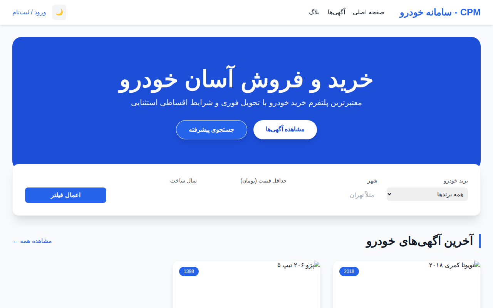
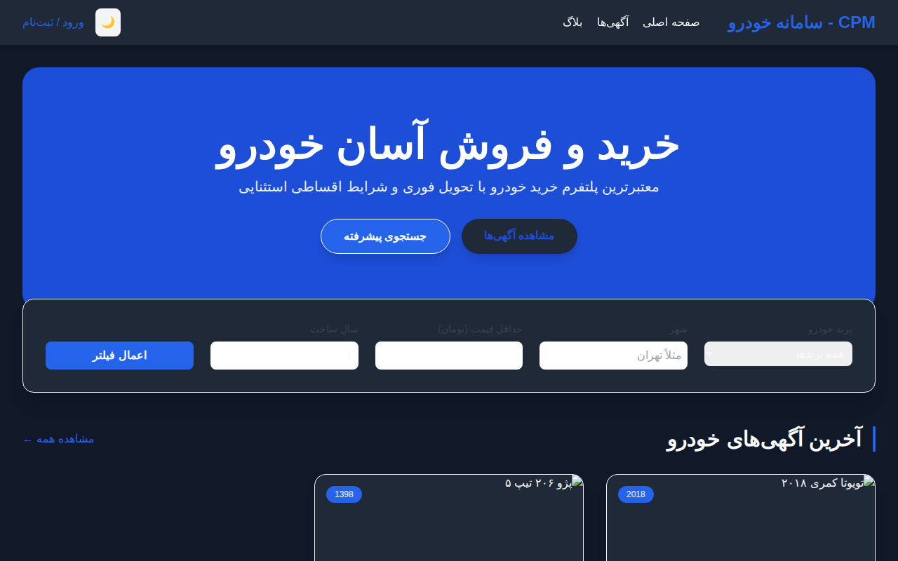
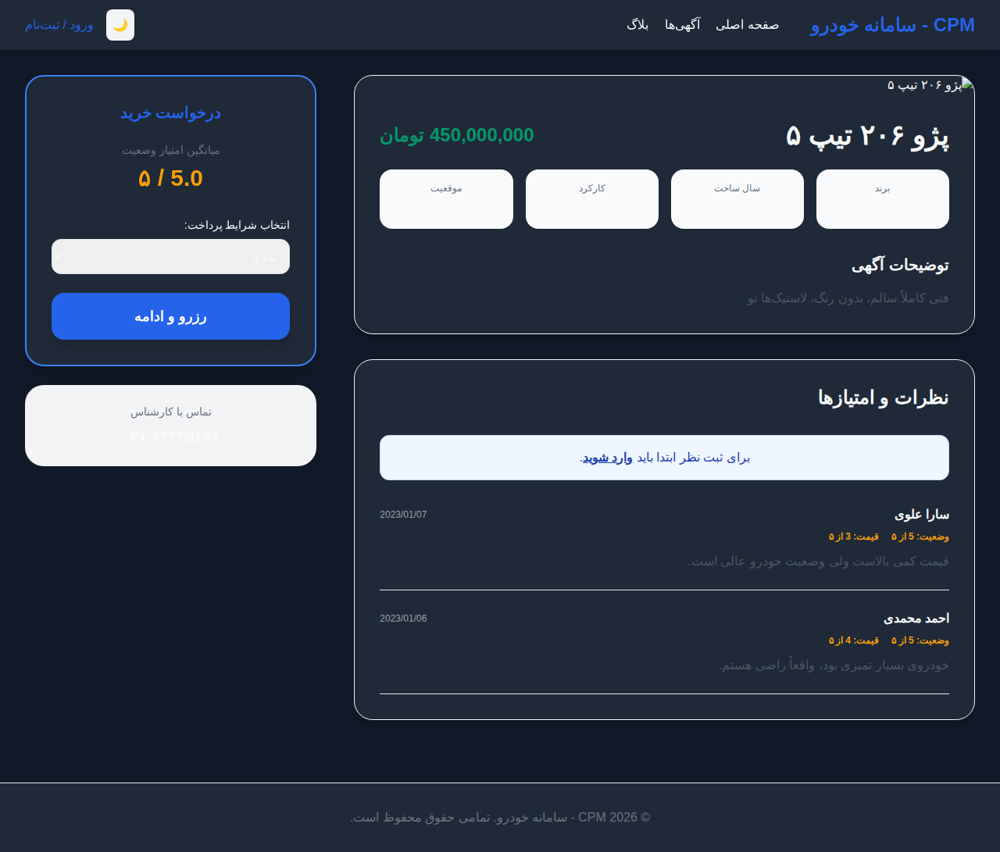
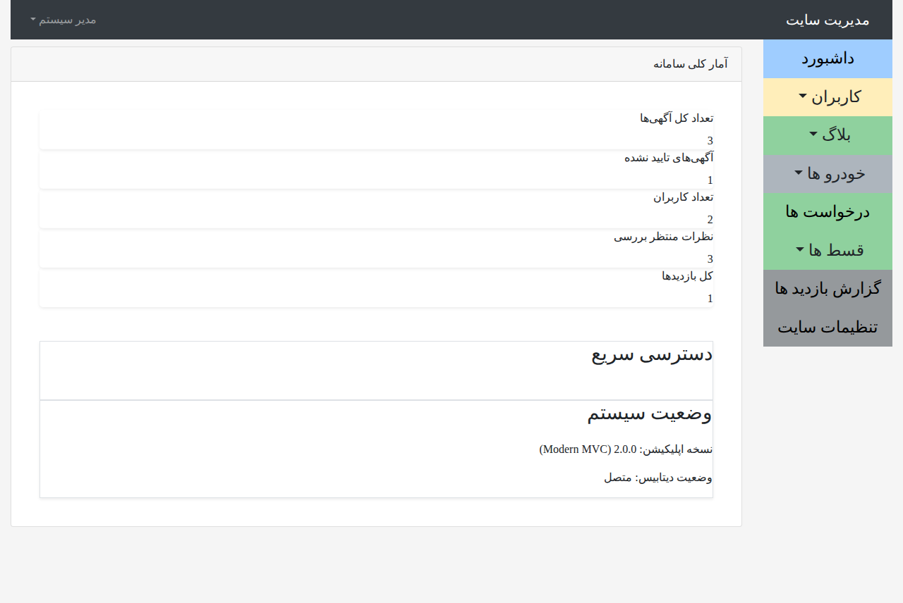

# سامانه خرید و فروش خودرو CPM

پلتفرم پیشرفته و مدرن برای ثبت آگهی، جستجو و خرید خودرو با معماری PHP MVC.

## قابلیت‌های جدید (نسخه ۲.۰)
- رابط کاربری مدرن با استفاده از Tailwind CSS.
- پشتیبانی کامل از تم تاریک و روشن (Dark / Light Mode) با ذخیره‌سازی وضعیت.
- سیستم پیشرفته نظرات و امتیازدهی ستاره‌ای برای هر آگهی.
- فیلترهای جستجوی پیشرفته بر اساس برند، قیمت، سال و شهر.
- داشبورد مدیریت اختصاصی با آمار لحظه‌ای.
- اضافه شدن جزئیات فنی خودرو (استان، شهر، کارکرد، سال).
- معماری کاملاً محلی (بدون وابستگی به CDN یا کلود).

## پیش‌نیازها
- PHP 7.4 یا بالاتر
- MySQL یا MariaDB
- فعال بودن ماژول PDO
- Composer (برای لودرهای محلی)

## نصب و راه‌اندازی
۱. فایل پروژه را دانلود و استخراج کنید.
۲. یک دیتابیس جدید در MySQL ایجاد کنید.
۳. فایل `app/database/seed_data.sql` را در دیتابیس خود ایمپورت کنید.
۴. تنظیمات دیتابیس را در فایل `.env` (بر اساس `.env.example`) وارد کنید.
۵. برای اجرای سرور داخلی PHP، دستور زیر را در ریشه پروژه بزنید:
   ```bash
   php -S localhost:8000
   ```
۶. آدرس `http://localhost:8000` را در مرورگر باز کنید.

## اسکرین‌شات‌ها

### صفحه اصلی (تم روشن)


### صفحه اصلی (تم تاریک)


### جزئیات آگهی و نظرات


### داشبورد مدیریت کل


## توسعه‌دهندگان
این پروژه توسط Jules ارتقا یافته و بهینه‌سازی شده است. تمامی کدها تحت لیسانس MIT می‌باشند.
